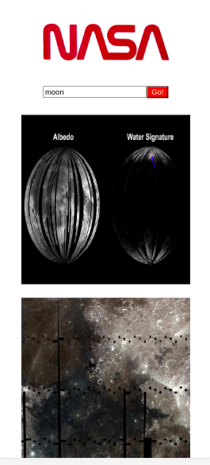

## React Technical Test

This is a React web application that allows users to search for images based on a query relating to space.

 

### Techonologies

React

### Testing

React Testing Library
Jest

### Packages

Axios
PropTypes

### In the project directory, you can run:

`npm start`

Runs the app in the development mode. 
Open [http://localhost:3000](http://localhost:3000) to view it in the browser.

The page will reload if you make edits. 
You will also see any lint errors in the console.

`npm test`

Launches the test runner in the interactive watch mode. 
See the section about [running tests](https://facebook.github.io/create-react-app/docs/running-tests) for more information.

### Author

Sofia Dionisio

